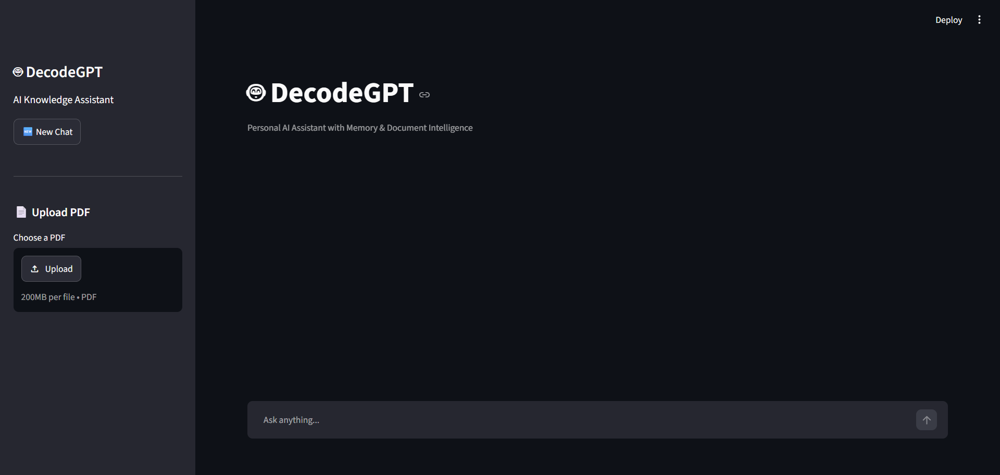
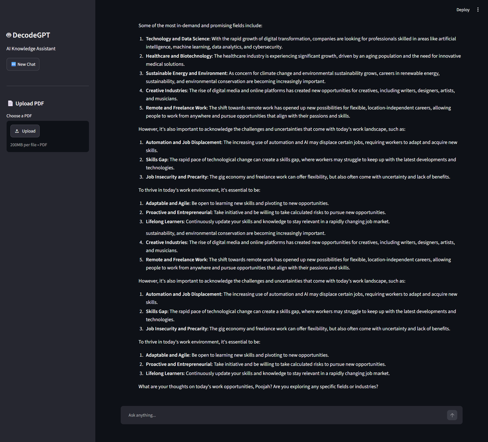
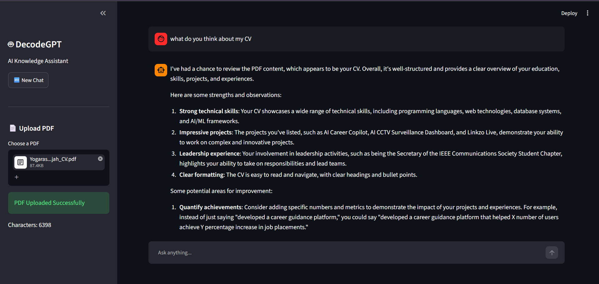
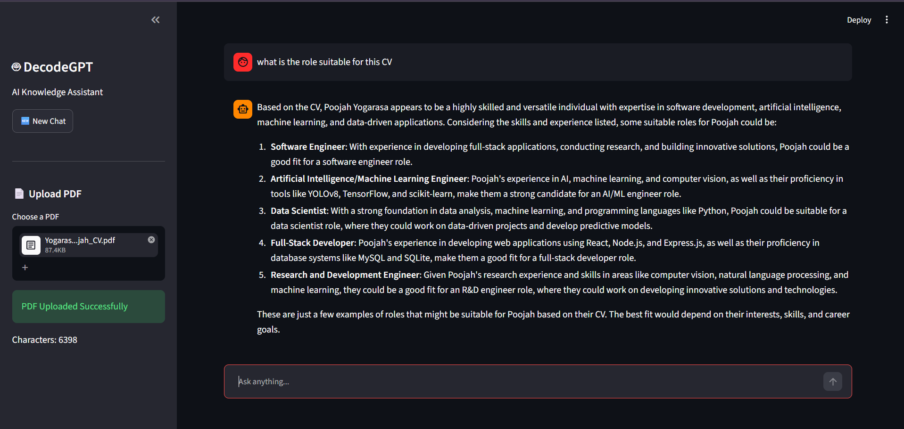

# 🤖 DecodeGPT

<p align="center">


</p>

<p align="center">

### AI Knowledge Assistant with Memory & Document Intelligence

Chat • Remember • Understand Documents • Answer Questions

</p>

---

## 🚀 Overview

DecodeGPT is an AI-powered knowledge assistant that combines conversational AI, persistent memory, and document intelligence into a single platform.

Users can interact naturally with the assistant, upload PDF documents, generate summaries, ask document-specific questions, and retrieve information directly from uploaded files.

The project demonstrates the integration of Large Language Models (LLMs), document processing, memory systems, and modern AI application development.

---

## ✨ Key Features

### 💬 AI Chat Assistant
- Natural language conversations
- Context-aware responses
- Powered by Groq Llama 3.3 70B

### 🧠 Persistent Memory
- Stores conversation history
- Maintains context across interactions
- SQLite-based memory system

### 📄 PDF Intelligence
- Upload PDF documents
- Automatic text extraction
- Document understanding and analysis

### 🔍 PDF Question Answering
- Ask questions directly about uploaded PDFs
- Extract important information
- Context-aware document responses

### 📝 AI Summarization
- Generate concise document summaries
- Identify key insights
- Quickly understand lengthy documents

### 🎨 Modern User Interface
- Interactive chat interface
- Dark-themed professional design
- Built with Streamlit

---

## 🛠️ Tech Stack

### Frontend


### Artificial Intelligence


### Backend


### Database


### Document Processing


---

## 🏗️ System Architecture

```text
User
 │
 ▼
Streamlit Interface
 │
 ▼
DecodeGPT Engine
 │
 ├── Groq LLM
 ├── SQLite Memory
 ├── PDF Processing
 └── Prompt Management
 │
 ▼
AI Response
```

---

## 📂 Project Structure

```text
DecodeGPT
│
├── chatbot.py
├── config.py
├── database.py
├── memory.py
├── prompts.py
├── rag.py
├── streamlit_app.py
├── requirements.txt
├── README.md
│
├── assets/
├── data/
└── uploads/
```

---

## 🚀 Installation

### Clone Repository

```bash
git clone https://github.com/poojahyogarasa/DecodeGPT.git

cd DecodeGPT
```

### Install Dependencies

```bash
pip install -r requirements.txt
```

### Configure Environment Variables

Create a `.env` file in the project root:

```env
GROQ_API_KEY=your_groq_api_key
```

### Run the Application

```bash
python -m streamlit run streamlit_app.py
```

---

## 📖 Example Questions

### General AI Chat

```text
What is Data Engineering?

Explain Machine Learning in simple terms.

How do REST APIs work?

What is the difference between SQL and NoSQL?
```

### PDF Summarization

```text
Summarize this PDF.

Give me a 5-point summary.

What is this document about?

Explain this PDF in simple language.
```

### PDF Question Answering

```text
What projects are mentioned in this resume?

What programming languages does this candidate know?

What certifications are listed?

What are the key findings of this research paper?

What leadership activities are included?
```

### Career Guidance

```text
Based on this resume, what jobs can I apply for?

What skills should I improve?

Analyze the strengths and weaknesses of this CV.

Create a learning roadmap for this candidate.
```

---

## 📸 Screenshots

### Main Interface



### Chat Intelligence



### Pdf Uploads





---

## 🎯 Future Enhancements

- Multiple PDF support
- Semantic document search
- Vector database integration
- Real Retrieval-Augmented Generation (RAG)
- PDF page citations
- User authentication
- Cloud deployment
- Chat export functionality
- Voice interaction support

---

## 👨‍💻 Author

### Poojah Yogarasa

Computer Engineering Undergraduate | AI & Software Engineering Enthusiast

🔗 GitHub: https://github.com/poojahyogarasa

🔗 LinkedIn: https://www.linkedin.com/in/poojah-yogarasa/

---

## ⭐ Project Status

```text
Version: DecodeGPT v1.0

Status: Completed
```

✅ AI Chat Assistant

✅ Persistent Memory System

✅ PDF Upload & Processing

✅ PDF Question Answering

✅ Document Summarization

✅ Modern Streamlit Interface

---

<p align="center">

Built with ❤️ using Python, Streamlit, Groq, SQLite, and PyPDF

</p>
